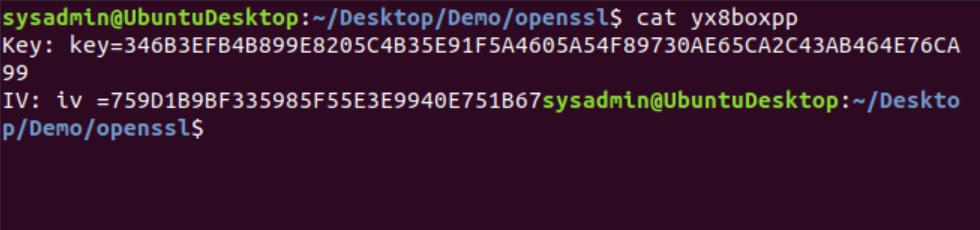
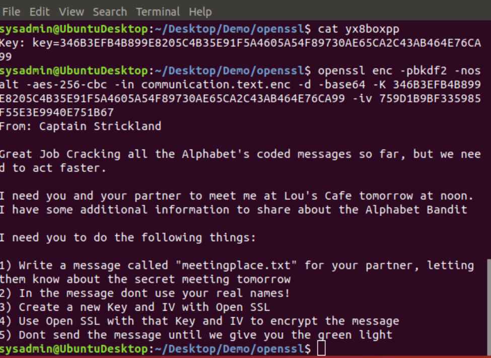
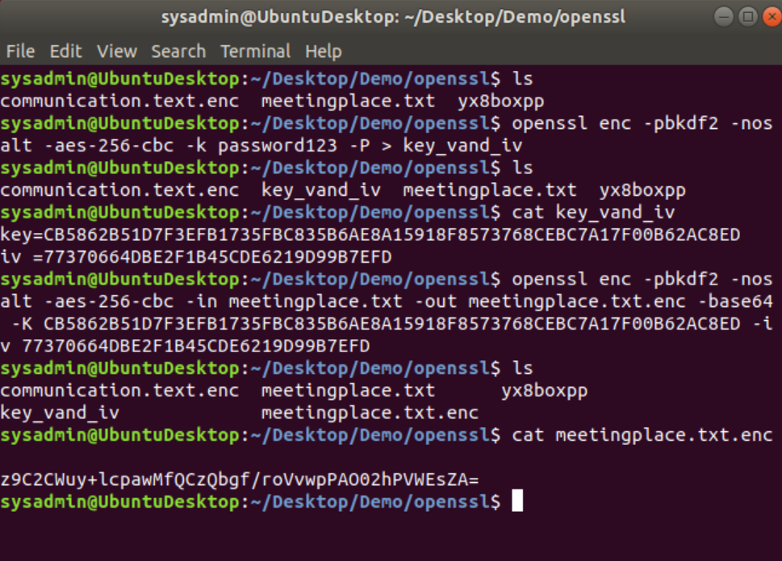

# OpenSSL Solutions

- Run: `wget tinyurl.com/yx8boxpp` to download the file. 
- Run: `cat yx8boxpp` to read the file. 



- Run the following command to decrypt the communication.txt.enc
  

```bash
    openssl enc -pbkdf2 -nosalt -aes-256-cbc -in communication.txt.enc -d -base64 -K    346B3EFB4B899E8205C4B35E91F5A4605A54F89730AE65CA2C43AB464E76CA99 -iv 759D1B9BF335985F55E3E9940E751B67
```



- Follow instructions of the decrypted message:

