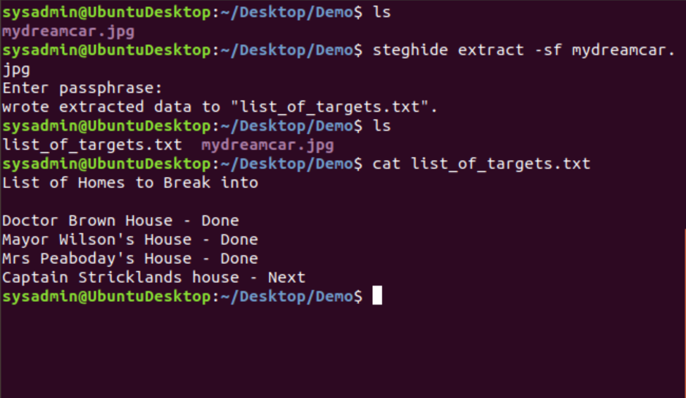

## Solution 

- Next, from the command line, go to your desktop directory to run the following `steghide` command:

  - `steghide extract -sf mydreamcar.jpg`

- When it asks for the password, enter the brand of the car:
   
  - `delorean`
         
- This extracts the hidden file, called  `list_of_targets.txt`.

- Preview the contents. This clearly reveals the previous and future targets of the Alphabet Bandit:

  ```
  List of Homes to Break Into

  Doctor Brown House - Done
  Mayor Wilson's House - Done
  Mrs Peaboday's House - Done
  Captain Strickland's house - Next
  ```

