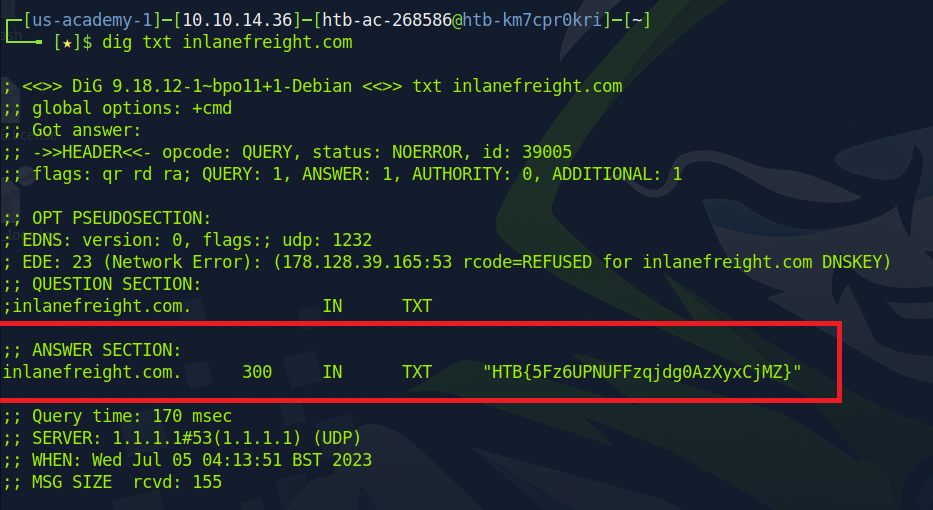
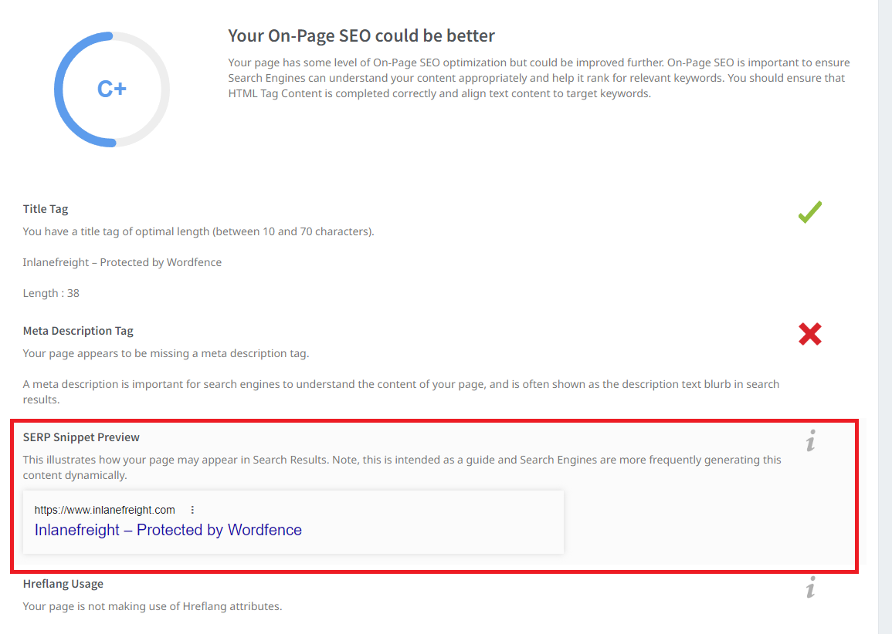

# OSINT-corporate-recon


**Sources:** https://academy.hackthebox.com/course/preview/osint-corporate-recon
This is a Module on HackTheBox platform, which covers the OSINT phase of security assessment. The module includes:
  - An overview of Open Source Intelligence Gathering
  - Gathering information about a target company
  - Gathering information about target personnel
  - Leveraging business and social networks
  - Using leak/breach data effectively

**Disclaimer:** The following message is from HackTheBox
> Important Note: In this module, a real company is used to illustrate efficiency based on real situations. Therefore, many graphics in the next sections are mostly censored in order not to put this company in focus. It is also strictly forbidden for students to use this module's content to trace the selected company and do further research against it or its personnel.

This document is solely served for educational purposes. I **DO NOT** promote illegal hacking of any kinds against any companies. I solely use this to document processing of enhancing my cybersecurity skill sets.

-----
# LOCATIONS
-----
1.  What are the city's coordinates where one of the company's offices, "inlanefreight.com" has its headquarters in Germany? (format: 00.0000 N, 0.0000 E)
 On the company website, `/offices` page, there's a paragraph mentioning offices in three different cities: Brighton, Oberhausen and Denver. We can look up their coordinates


> ***51.4878 N, 6.8633 E***

2. What are the city's coordinates where one of the company's offices, "inlanefreight.com" has its headquarters in United Kingdom? (format: 00.0000 N, 0.0000 W)
> ***50.8229 N, 0.1363 W***

3. What are the city's coordinates where one of the company's offices, "inlanefreight.com" has its headquarters in USA? (format: 00.0000 N, 000.0000 W)
> ***39.7392 N, 104.9903 W***

For the next two questions, answers can be found on `/about-us` page


4.  In which country is the chief financial officer located?
> ***Germany***

5.  How many locations does the company have in total? (format: <num>)
> ***14***

-----
# STAFF
-----
1. Check the website www.inlanefreight.com and find out the name of the chief operating officer and submit his full name as the answer.
 This can be found on `/about-us` page
> ***Max Cartmoon***

2. How many positions does the company Inlanefreight want to have filled in the future?
This can be found on `/career` page
> ***15***

3. How many logistics and software specialists does the Inlanefreight company employ at least?
This can be found on homepage
> ***40***

-----
# CONTACT INFORMATION
-----
1. Check the website www.inlanefreight.com and find out the email address of John Smith and submit it as the answer.
This can be found on `/contact` page

> ***john.smith4@inlanefreight.com***

2. What is the email address for enterprise customer support?
This one is tricky as `enterprise@inlanefreight.com` is considered incorrect answer. After careful inspect, I found the email to be a different one. I was able to obtain the correct email by hovering over the `enterprise@inlanefreight.com` email


> ***enterprise-support@inlanefreight.com***

-----
# BUSINESS RECORDS
-----
- Investigate the website www.inlanefreight.com and find out how much EBIT they recorded for the third quarter of 2020 and submit it as the answer. (Format example: GBP 000,000)
This can be found on `/news` page

> ***USD 276,000,000***

-----
# SERVICES
-----
1. Investigate the website www.inlanefreight.com and find out the name of the API application the company uses and submit it as the answer.
This can be found on the Home Page

> ***InlaneConnect***

2. How many liners does the company own in total?
This can be found on `/about-us` page

> ***72***

-----
# SOCIAL NETWORKS
-----
How many social networks are shown on the website of the company Inlanefreight?
> ***4***

-----
# PUBLIC DOMAIN RECORD
-----
1. Find out how many nameservers are responsible for the inlanefreight.com domain and submit the number as the answer.
- Run `dig ns inlanefreight.com` to find out the nameservers of inlanefreight.om


> ***2***

2.  Find out the FQDN of the mail server of the inlanefreight.com domain and submit it as the answer.
This information can be obtain from the  `host inlanefreight.com` command 


> ***mail1.inlanefreight.com***

3.  What is the registry domain ID of inlanefreight.com?
- This can be obtained by running 
```bash
whois inlanefreight.com
```


 > ***2420436757_DOMAIN_COM-VRSN***

4.  What is the name of the registrar of this domain?

> ***Amazon Registrar, Inc.***

5.  Examine the DNS records and submit the TXT record as the answer.
- Run the following command
```bash
dig txt inlanefreight.com
```



> ***HTB{5Fz6UPNUFFzqjdg0AzXyxCjMZ}***

-----
# DOMAIN STRUCTURE
-----

1. Investigate the website www.inlanefreight.com and find out the Apache version of the webserver and submit it as the answer. (Format: 0.0.00)
- Run a search on [Shodan](https://www.shodan.io/), we can obtain a lot of information about the company's domain structure


> ***2.4.29***

2. What is the hosting provider for the inlanefreight.com domain?

> ***DigitalOcean, LLC (DO-13)***

3.  What is the ASN for the inlanefreight.com domain?
- Run `whois` command on the inlanefreight.com's IP to obtain the ASN
```bash
whois 134.209.24.248
```


> ***AS14061***

4.  On which operating system is the webserver www.inlanefreight.com running?

> ***Ubuntu***

5. How many JS resources are there on the Inlanefreight website?
- Run a search on [SEOptimer.](https://www.seoptimer.com/)


> ***9***

-----
# CLOUD STORAGE
-----
1. Investigate the website and find the bucket name of AWS that the company used and submit it as the answer. (Format: sub.domain.tld)
- Inspect the `Inlanefreight-Goals` file on `/news` page, we'll see the cloud storage used.


> ***inlanefreight-comp133.s3.amazonaws.htb***

-----
# Email Address
-----
What is the email address of the CEO?

- Inspect the `/about-us` page, we'll see the ceo's email


> ***jeremy-ceo@inlanefreight.com***

-----
# THIRD PARTIES
-----
1. Investigate the website www.inlanefreight.com and find out which cloud provider the company most likely focuses on and submit it as the answer.
- From the previous question in **Cloud Storage** section, we can tell they're using AWS

> ***AWS***

-----
# TECHNOLOGIES IN USE
-----
1. Which version of WordPress is used on the Inlanefreight domain page?
- Using `Wappalyzer`, we see the website is using Wordpress 5.6.11


- However, consider the time of this module, the correct answer is 5.6.10. We can confirm this by checking `www.inlanefreight.com` older versions on archive.org


- Even though we see multiple versions of Wordpress, it is evident the company always updates WordPress (based on the Wappalyzer output). Therefore, we can safely assume that the WP version is 5.6.10

> ***5.6.10***

2. What is the name of the theme that is used on the WordPress site?
- From the above screenshot, we have

> ***ben_theme***

3.  Which WAF is being used? (Format: <name>)
- Run a search on [shodan](https://shodan.io), I found the company was using Wordfence WAF


- This can be confirmed on [SEOptimer](https://seoptimer.com)


> ***Wordfence***

-----
# INTERNAL LEAKS
-----
1. Investigate the website www.inlanefreight.com and try to find any additional information that a file might contain and submit the found flag as the answer.

On the `/news` page, there is a downloadable file called `Inlanefreight-Goals`. Download the file and run `exiftool` command to extract its information.
```bash
exiftool goals.pdf
```


> ***HTB{1nt3rn4LL34Ks4r3C0mm0n}***

-----
# ACCOMPLISHMENTS - LESSON LEARNED - SKILLS GAINED
-----
- Develop strong Open Source Intelligence (OSINT) skills.
- Gather information about a target company and target personnel.
- Learn how to leverage business and social networks for information gathering.
- Effectively utilize leak/breach data.
- Understand the methodology and tactics of OSINT gathering.
- Engage in hands-on exercises to practice OSINT techniques.
- No time limit or grading, but completion of exercises and skills assessment is required.
- Assumes working knowledge of the Linux command line and information security fundamentals.
- Completion of prerequisite modules such as Introduction to Networking and Linux Fundamentals is recommended.
- Cover various aspects of OSINT, including business investigation, organization, locations, staff, contact information, business records, services, social networks, domain information, public domain records, domain structure, cloud storage, email addresses, third parties, compounded networks, technologies in use, leaked information, archives, internal leaks, breaches, and intelligence.
